# Love Streak Feature - Quick Start Guide

## 🎯 What Is This?

A TikTok-style daily streak system for married couples in your Discord bot. Both partners must use `/love` daily to maintain their streak!

## 📋 Quick Facts

| Aspect | Details |
|--------|---------|
| **Command** | `/love` |
| **Who Can Use** | Married couples only |
| **Reset Time** | 12:00 AM UTC+7 (Vietnam time) |
| **Recoveries** | 3 per month |
| **Server ID** | `1449180531777339563` |
| **Emojis** | emoji_43~1 (⏳), emoji_48 (✅), emoji_57 (💔) |

## 🎮 How It Works

```mermaid
graph LR
    A[User A uses /love] --> B{Partner completed?}
    B -->|No| C[Show Streak Box<br/>A: ✅ B: ⏳<br/>Wait for partner]
    B -->|Yes| D[Both Complete!<br/>Streak +1<br/>See you in 12 hours]
    
    E[Miss a day] --> F{Recoveries left?}
    F -->|Yes 1-3| G[Streak Recovered<br/>X times remaining]
    F -->|No 0| H[Streak Lost 💔<br/>Reset to 0]
```



## 🚀 Implementation Steps

### 1. Documentation (✅ COMPLETE)
- [x] Requirements defined
- [x] Architecture designed
- [x] Tasks planned (59 hours)
- [x] Testing strategy created
- [x] Configuration confirmed

### 2. Review Documentation (NEXT STEP)
```bash
# Run these commands to validate docs
/review-requirements
/review-design
```

### 3. Implementation (After Review)
```bash
# When ready to code
/execute-plan
```

## 📁 Files to Create

### New Files (4)
1. `src/commands/love.ts` - Command handler
2. `src/services/loveStreakService.ts` - Business logic
3. `src/services/streakResetService.ts` - Daily reset cron
4. `src/services/recoveryResetService.ts` - Monthly recovery reset

### Modified Files (4)
1. `src/services/marriageService.ts` - Add streak to certificate
2. `src/services/statusService.ts` - Add streak to status
3. `src/utils/translations.ts` - Add Vietnamese messages
4. `src/index.ts` - Register command & cron jobs

### Database
1. Migration: Create `love_streaks` table

## 🕐 Timeline

| Phase | Duration | Tasks |
|-------|----------|-------|
| Foundation | 6.5 hrs | Database + core service |
| Core Features | 10.5 hrs | Completion + recovery logic |
| Command | 3.5 hrs | Command handler |
| Integration | 4 hrs | Marriage + status integration |
| Cron Jobs | 8 hrs | Daily + monthly resets |
| Testing | 22 hrs | Unit + integration + e2e |
| Documentation | 4.5 hrs | Code docs + user guide |
| **TOTAL** | **59 hrs** | ~18 working days |

## 🔧 Key Configuration

```typescript
// Cron schedules (in UTC, converts to UTC+7)
DAILY_RESET: '0 17 * * *'    // 17:00 UTC = 00:00 UTC+7
MONTHLY_RESET: '0 17 1 * *'  // 1st at 17:00 UTC = 1st at 00:00 UTC+7

// Constants
MAX_RECOVERIES: 3
UTC_OFFSET: 7
GUILD_ID: '1449180531777339563'
```

## 📊 Success Criteria

- [ ] Both partners must complete to increment streak
- [ ] Visual Streak Box shows clear status
- [ ] 3 recoveries per month work correctly
- [ ] Resets at midnight UTC+7 daily
- [ ] Integrates with `/giaykh` and `/status`
- [ ] 100% test coverage
- [ ] No race conditions on concurrent use

## 🎨 User Experience

### Scenario 1: First Partner
```
User A uses /love

💕 Streak Box
User A: ✅
User B: ⏳

Streak hiện tại: 5 ngày
```

### Scenario 2: Both Complete
```
User B uses /love

✅ Streak maintained successfully!
Your streak is 6 days.
See you again in 12 hours.
```

### Scenario 3: Recovery
```
User A uses /love (after missing a day)

🔄 Streak recovered successfully!
2 times remaining.
Please be careful with your streak.
```

### Scenario 4: Streak Lost
```
User A uses /love (after 3 recoveries used)

💔 You both failed the streak.

(Streak resets to 0, can start fresh)
```

## 📚 Documentation Files

| File | Purpose |
|------|---------|
| `docs/ai/requirements/feature-love-streak.md` | Requirements & user stories |
| `docs/ai/design/feature-love-streak.md` | Architecture & technical design |
| `docs/ai/planning/feature-love-streak.md` | Task breakdown & timeline |
| `docs/ai/implementation/feature-love-streak.md` | Implementation guide |
| `docs/ai/testing/feature-love-streak.md` | Testing strategy |
| `docs/ai/LOVE_STREAK_CONFIG.md` | Configuration reference |
| `docs/ai/LOVE_STREAK_QUICKSTART.md` | This file! |

## ❓ FAQ

**Q: What happens if one partner never completes?**
A: The streak won't increment. Both must complete daily.

**Q: Can we recover a streak after it's lost?**
A: No, once lost (after 3 recoveries), it resets to 0. You start fresh.

**Q: What if we miss multiple days in a row?**
A: Each missed day counts as one recovery use. Missing 3 days = 3 recoveries used.

**Q: Does the streak count reset each month?**
A: No! Only the recovery counter resets. Your streak continues.

**Q: What happens if we divorce?**
A: Streak data persists in database but is no longer accessible. If you remarry, you start a new streak.

## 🚦 Next Steps

1. **Review Documentation** (You are here!)
   - Run `/review-requirements`
   - Run `/review-design`
   - Address any feedback

2. **Start Implementation**
   - Run `/execute-plan`
   - Follow task breakdown in planning doc
   - Write tests alongside code

3. **Testing**
   - Unit tests (100% coverage)
   - Integration tests
   - Manual testing in Discord

4. **Deployment**
   - Deploy to production
   - Monitor first reset at midnight UTC+7
   - Gather user feedback

---

**Ready to proceed?** Run `/review-requirements` to validate the requirements document! 🚀
