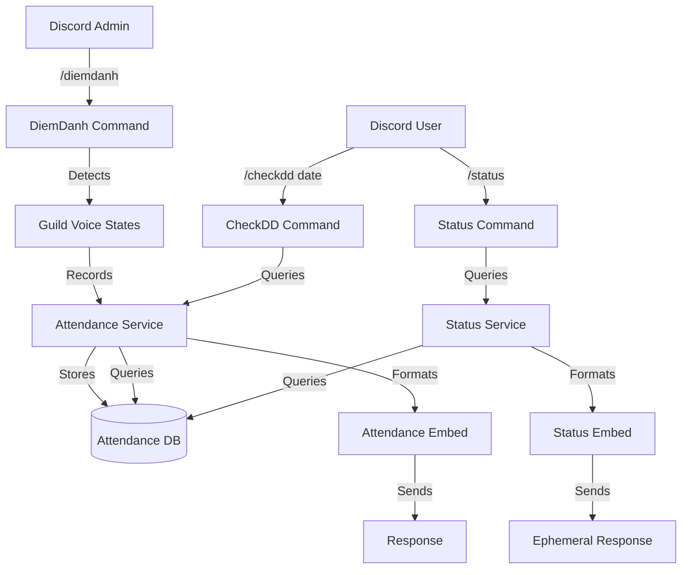

# System Design & Architecture

## Architecture Overview
**What is the high-level system structure?**



**Key components and their responsibilities:**
1. **DiemDanh Command**: Handles `/diemdanh` slash command, detects users in voice channels, calls attendance service
2. **CheckDD Command**: Handles `/checkdd [date]` slash command, queries attendance records, formats response
3. **Attendance Service**: Manages attendance data operations (create, query, aggregate)
4. **Status Service**: Extended to include attendance information in user status
5. **Database Layer**: Prisma queries to store and fetch attendance records
6. **Voice State Detection**: Discord.js voice state API to detect users in voice channels

**Technology stack choices and rationale:**
- **Discord.js v14**: Voice state detection (`GuildVoiceStates`), embed formatting, command handling
- **Prisma**: Database operations for attendance records
- **TypeScript**: Type safety for attendance data structures
- **Existing bot infrastructure**: Leverage command handler system and status service
- **Discord API**: Voice state information via `GuildVoiceStates` collection

## Data Models
**What data do we need to manage?**

**Attendance Data Structure:**
```typescript
interface Attendance {
  id: number;
  userId: string;
  guildId: string;
  channelId: string; // Voice channel ID
  recordedAt: Date; // Timestamp when attendance was taken
  date: string; // Date in YYYY-MM-DD format for easy querying
}

interface AttendanceRecord {
  userId: string;
  channelId: string;
  channelName: string;
  recordedAt: Date;
}

interface AttendanceStats {
  totalDays: number;
  lastAttendanceDate: Date | null;
}
```

**Database Schema (Prisma):**
```prisma
model Attendance {
  id         Int      @id @default(autoincrement())
  userId     String   @map("user_id")
  guildId    String   @map("guild_id")
  channelId  String   @map("channel_id")
  recordedAt DateTime @default(now()) @map("recorded_at")
  date       String   // YYYY-MM-DD format

  @@index([userId, guildId, date])
  @@index([guildId, date])
  @@index([date])
  @@map("attendances")
}
```

**Database Queries Needed:**
1. **Create Attendance**: Insert attendance records for multiple users
2. **Query by Date**: Get all attendance records for a specific date and guild
3. **Query User Stats**: Get attendance statistics for a user in a guild
4. **Query Last Attendance**: Get most recent attendance date for a user

**Data Flow:**
1. `/diemdanh` command:
   - Command detects all users in voice channels via `guild.voiceStates.cache`
   - Filters out bots (default: bots are excluded)
   - For each user, create attendance record with current UTC timestamp and UTC date (YYYY-MM-DD)
   - Store records in database (batch insert for efficiency)
   - Return confirmation with count

2. `/checkdd [date]` command:
   - Parse date parameter (default to today in UTC if not provided)
   - Validate date format (YYYY-MM-DD) and ensure not future date
   - Query database for attendance records matching date and guild (using UTC)
   - Group by user and format as embed
   - Return embed with list of users

3. `/status` command (extended):
   - Query attendance statistics for user (using UTC dates)
   - Calculate total unique days attended
   - Get most recent attendance date
   - Add attendance fields to existing status embed

## API Design
**How do components communicate?**

**Attendance Service Interface:**
```typescript
class AttendanceService {
  /**
   * Record attendance for users currently in voice channels
   * @param guildId Guild ID
   * @param voiceStates Map of user IDs to voice channel IDs
   * @returns Number of users recorded
   * @throws Error if database operation fails
   */
  async recordAttendance(
    guildId: string,
    voiceStates: Map<string, string>
  ): Promise<number>;
  
  /**
   * Get attendance records for a specific date
   * @param guildId Guild ID
   * @param date Date in YYYY-MM-DD format
   * @returns Array of attendance records with user information
   * @throws Error if database query fails
   */
  async getAttendanceByDate(
    guildId: string,
    date: string
  ): Promise<AttendanceRecord[]>;
  
  /**
   * Get attendance statistics for a user
   * @param userId User ID
   * @param guildId Guild ID
   * @returns Attendance statistics
   * @throws Error if database query fails
   */
  async getUserAttendanceStats(
    userId: string,
    guildId: string
  ): Promise<AttendanceStats>;
}
```

**Command Interfaces:**
```typescript
// DiemDanh command structure
{
  data: SlashCommandBuilder
    .setName('diemdanh')
    .setDescription('Take attendance of all users in voice channels'),
  execute: async (interaction: ChatInputCommandInteraction) => {
    // Implementation
  }
}

// CheckDD command structure
{
  data: SlashCommandBuilder
    .setName('checkdd')
    .setDescription('Check attendance records for a specific date')
    .addStringOption(option =>
      option
        .setName('date')
        .setDescription('Date in YYYY-MM-DD format (defaults to today)')
        .setRequired(false)
    ),
  execute: async (interaction: ChatInputCommandInteraction) => {
    // Implementation
  }
}
```

## Component Breakdown
**What are the major building blocks?**

**1. DiemDanh Command (`src/commands/diemdanh.ts`)**
- Handles slash command interaction
- Detects users in voice channels via `guild.voiceStates.cache`
- Filters out bots (default: bots are excluded from attendance records)
- Calls attendance service to record attendance
- Returns confirmation message with count
- Error handling:
  - No users in voice channels: "No users are currently in voice channels."
  - Permission error: "Bot does not have permission to view voice channels."
  - Database error: "An error occurred while recording attendance."

**2. CheckDD Command (`src/commands/checkdd.ts`)**
- Handles slash command interaction
- Parses date parameter (defaults to today if not provided)
- Validates date format (YYYY-MM-DD)
- Calls attendance service to query records
- Formats results as embed
- Returns embed with list of users
- Error handling:
  - Invalid date format: "Invalid date format. Please use YYYY-MM-DD format."
  - No records: "No attendance records found for [date]."
  - Future date: "Cannot check attendance for a future date."

**3. Attendance Service (`src/services/attendanceService.ts`)**
- `recordAttendance()`: Batch insert attendance records
  - Takes map of user IDs to channel IDs
  - Creates records with current timestamp and date
  - Returns count of records created
- `getAttendanceByDate()`: Query attendance by date
  - Queries database for matching records
  - Groups by user (deduplicate if user in multiple channels)
  - Returns array with user information
- `getUserAttendanceStats()`: Get user statistics
  - Counts total unique days attended (using UTC dates)
  - Gets most recent attendance date (using UTC)
  - Returns statistics object with totalDays and lastAttendanceDate
- Helper methods:
  - Date formatting and validation
  - Batch insert optimization

**4. Status Service Extension (`src/services/statusService.ts`)**
- Extend `getUserStatus()` to include attendance statistics
- Extend `formatStatusEmbed()` to add attendance fields
- Add attendance section to status embed:
  - Total days attended
  - Last attendance date

**5. Database Schema (Prisma Migration)**
- Create `Attendance` table with indexes
- Add indexes for efficient querying:
  - `[userId, guildId, date]` for user stats
  - `[guildId, date]` for date queries
  - `[date]` for general date queries

**6. Voice State Detection**
- Use `guild.voiceStates.cache` to get all voice states
- Filter for users actually in channels (not null channel)
- Filter out bots (default: bots are excluded from attendance records)
- Extract user ID and channel ID pairs
- Handle edge cases:
  - Users in multiple channels (record once per user, use first channel found)
  - Bots in channels (excluded by default)

## Design Decisions
**Why did we choose this approach?**

**1. Separate Attendance Service**
- **Decision**: Create dedicated `AttendanceService` for attendance operations
- **Rationale**: Separation of concerns, reusable service, easier to test
- **Alternative**: Put logic directly in commands (rejected - less maintainable)

**2. Batch Insert for Attendance Records**
- **Decision**: Use batch insert when recording multiple users
- **Rationale**: More efficient than individual inserts, better performance
- **Alternative**: Individual inserts (rejected - slower for many users)

**3. Date as String Field with UTC**
- **Decision**: Store date as separate string field (YYYY-MM-DD) using UTC timezone
- **Rationale**: Easier querying by date, timezone-independent, simpler queries, consistent across servers
- **Alternative**: Use DateTime and extract date (rejected - more complex queries)
- **Alternative**: Use server timezone (rejected - inconsistent across servers)

**4. Extend Status Service**
- **Decision**: Add attendance to existing status service
- **Rationale**: Status already aggregates user data, natural fit
- **Alternative**: Separate attendance status (rejected - less cohesive)

**5. Public vs Ephemeral Responses**
- **Decision**: `/diemdanh` and `/checkdd` are public, `/status` is ephemeral
- **Rationale**: Attendance is public information, personal status is private
- **Alternative**: All ephemeral (rejected - attendance should be transparent)

**6. Voice State Detection Method**
- **Decision**: Use `guild.voiceStates.cache` to detect users
- **Rationale**: Efficient, real-time, no need for voice connection
- **Alternative**: Connect to voice channels (rejected - unnecessary complexity)

**7. Bot Intent Requirements**
- **Decision**: Require `GUILD_VOICE_STATES` intent
- **Rationale**: Necessary to detect users in voice channels
- **Alternative**: No intent (rejected - won't work without it)

**8. Bot Exclusion from Attendance**
- **Decision**: Exclude bots from attendance records by default
- **Rationale**: Bots are not real users, attendance tracking is for human participants
- **Alternative**: Include bots (rejected - not meaningful for attendance tracking)

## Non-Functional Requirements
**How should the system perform?**

**Performance:**
- Command response time: < 3 seconds for `/diemdanh`
- Command response time: < 2 seconds for `/checkdd`
- Database queries: Optimized with indexes
- Batch insert: < 1 second for up to 100 users

**Scalability:**
- Handles concurrent attendance commands
- Database indexes support efficient queries
- Batch operations for multiple users
- No rate limiting needed (admin-only command)

**Security:**
- Input validation: Date format validation
- No sensitive data exposure (only public attendance info)
- Permission checks for voice channel access
- Guild-specific data isolation

**Reliability:**
- Graceful error handling for missing data
- Clear error messages for invalid inputs
- Handles edge cases (no users, no records, invalid dates)
- Database transaction safety for batch inserts

**Bot Permissions Required:**
- `VIEW_CHANNELS` - To see voice channels
- `GUILD_VOICE_STATES` intent - To detect users in voice channels

