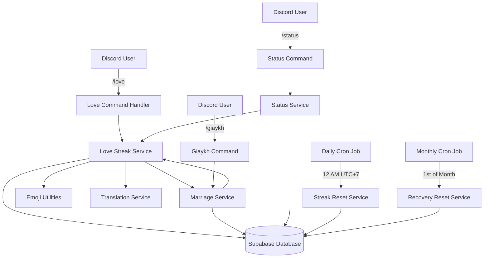
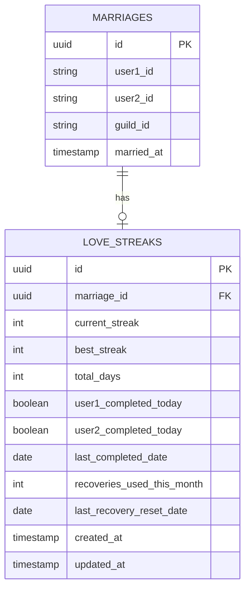

# System Design & Architecture

## Architecture Overview
**What is the high-level system structure?**



### Key Components and Responsibilities

1. **Love Command Handler** (`src/commands/love.ts`)
   - Handles `/love` slash command
   - Validates user is married
   - Delegates to LoveStreakService
   - Formats and sends response embeds

2. **Love Streak Service** (`src/services/loveStreakService.ts`)
   - Core business logic for streak management
   - Checks completion status for both partners
   - Increments streaks when both complete
   - Handles recovery logic
   - Resets streaks when recoveries exhausted
   - Generates Streak Box embeds

3. **Marriage Service** (existing, modified)
   - Integration point for marriage data
   - Modified to include streak count in certificate footer
   - Provides marriage validation

4. **Status Service** (existing, modified)
   - Modified to display streak count in user status

5. **Streak Reset Service** (`src/services/streakResetService.ts`)
   - Scheduled job running daily at 12 AM UTC+7 (17:00 UTC)
   - Resets daily completion flags
   - Identifies missed days for recovery/loss logic

6. **Recovery Reset Service** (`src/services/recoveryResetService.ts`)
   - Scheduled job running monthly on 1st at 12 AM UTC+7 (17:00 UTC on 1st)
   - Resets recovery count to 0 for all couples

### Technology Stack
- **Runtime**: Node.js with TypeScript
- **Discord API**: Discord.js v14
- **Database**: Supabase (PostgreSQL)
- **Scheduling**: node-cron for scheduled jobs
- **Emoji Handling**: Existing emoji utilities (`src/utils/emojis.ts`)
- **Translations**: Existing translation service (`src/utils/translations.ts`)

## Data Models
**What data do we need to manage?**

### New Table: `love_streaks`

```sql
CREATE TABLE love_streaks (
  id UUID PRIMARY KEY DEFAULT uuid_generate_v4(),
  marriage_id UUID NOT NULL REFERENCES marriages(id) ON DELETE CASCADE,
  current_streak INTEGER NOT NULL DEFAULT 0,
  best_streak INTEGER NOT NULL DEFAULT 0,
  total_days INTEGER NOT NULL DEFAULT 0,
  
  -- Daily completion tracking
  user1_completed_today BOOLEAN NOT NULL DEFAULT FALSE,
  user2_completed_today BOOLEAN NOT NULL DEFAULT FALSE,
  last_completed_date DATE,
  
  -- Recovery tracking
  recoveries_used_this_month INTEGER NOT NULL DEFAULT 0,
  last_recovery_reset_date DATE NOT NULL DEFAULT CURRENT_DATE,
  
  -- Timestamps
  created_at TIMESTAMP WITH TIME ZONE DEFAULT NOW(),
  updated_at TIMESTAMP WITH TIME ZONE DEFAULT NOW(),
  
  -- Constraints
  CONSTRAINT unique_marriage_streak UNIQUE (marriage_id),
  CONSTRAINT valid_streak_values CHECK (current_streak >= 0 AND best_streak >= 0 AND total_days >= 0),
  CONSTRAINT valid_recoveries CHECK (recoveries_used_this_month >= 0 AND recoveries_used_this_month <= 3)
);

-- Index for efficient queries
CREATE INDEX idx_love_streaks_marriage_id ON love_streaks(marriage_id);
CREATE INDEX idx_love_streaks_last_completed ON love_streaks(last_completed_date);
```

### Data Model Relationships



### Data Flow

**Flow 1: User Completes Daily Streak**
```
User uses /love
  → Check marriage exists
  → Get or create love_streak record
  → Check if user already completed today
  → Mark user as completed
  → Check if partner completed
    → If yes: Increment streak, update last_completed_date
    → If no: Show waiting status
  → Return formatted response
```

**Flow 2: Daily Reset (12 AM UTC+7)**
```
Cron job triggers at 17:00 UTC (00:00 UTC+7)
  → Get all love_streak records
  → For each record:
    → Check last_completed_date
    → If yesterday and both completed:
      → Reset completion flags
    → If yesterday and not both completed:
      → Check recoveries_used_this_month
        → If < 3: Increment recoveries
        → If = 3: Reset current_streak to 0
      → Reset completion flags
  → Update records
```

**Flow 3: Monthly Recovery Reset (1st of Month at 12 AM UTC+7)**
```
Cron job triggers at 17:00 UTC on 1st (00:00 UTC+7 on 1st)
  → Get all love_streak records
  → For each record:
    → Set recoveries_used_this_month = 0
    → Set last_recovery_reset_date = today
  → Update records
```

## API Design
**How do components communicate?**

### Internal Service Interface: `LoveStreakService`

```typescript
interface LoveStreakService {
  /**
   * Process a user's daily love streak completion
   * @param userId Discord user ID
   * @param guildId Discord guild ID
   * @returns Streak status and message data
   */
  processLoveStreak(userId: string, guildId: string): Promise<LoveStreakResult>;
  
  /**
   * Get current streak data for a marriage
   * @param marriageId Marriage UUID
   * @returns Current streak information
   */
  getStreak(marriageId: string): Promise<LoveStreak | null>;
  
  /**
   * Get streak by user ID (looks up marriage first)
   * @param userId Discord user ID
   * @param guildId Discord guild ID
   * @returns Current streak information
   */
  getStreakByUserId(userId: string, guildId: string): Promise<LoveStreak | null>;
  
  /**
   * Format streak box embed showing both partners' status
   * @param streak Streak data
   * @param marriage Marriage data
   * @param client Discord client for emoji lookup
   * @returns Formatted embed
   */
  formatStreakBoxEmbed(
    streak: LoveStreak,
    marriage: Marriage,
    client: Client
  ): Promise<EmbedBuilder>;
  
  /**
   * Reset daily completion flags (called by cron)
   * @returns Number of records processed
   */
  resetDailyCompletions(): Promise<number>;
  
  /**
   * Reset monthly recovery counts (called by cron)
   * @returns Number of records processed
   */
  resetMonthlyRecoveries(): Promise<number>;
}

interface LoveStreakResult {
  status: 'first_completed' | 'both_completed' | 'already_completed' | 'streak_recovered' | 'streak_lost';
  streak: LoveStreak;
  marriage: Marriage;
  message: string;
  recoveriesRemaining?: number;
  isLastRecovery?: boolean; // True when this is the 3rd (final) recovery use - triggers warning message
}

interface LoveStreak {
  id: string;
  marriage_id: string;
  current_streak: number;
  best_streak: number;
  total_days: number;
  user1_completed_today: boolean;
  user2_completed_today: boolean;
  last_completed_date: Date | null;
  recoveries_used_this_month: number;
  last_recovery_reset_date: Date;
  created_at: Date;
  updated_at: Date;
}
```

### Command Interface: `/love`

```typescript
// Discord Slash Command
{
  name: 'love',
  description: 'Duy trì streak tình yêu hàng ngày với đối tác',
  options: [] // No options needed
}
```

### Modified Interfaces

**MarriageService Extension**
```typescript
interface MarriageService {
  // Existing methods...
  
  /**
   * Format certificate embed with streak count in footer
   * (Modified to include streak)
   */
  formatCertificateEmbed(
    marriage: Marriage,
    certificate: Certificate,
    user1Name: string,
    user2Name: string
  ): Promise<{ embed: EmbedBuilder; attachment: AttachmentBuilder | null }>;
}
```

**StatusService Extension**
```typescript
interface StatusService {
  // Existing methods...
  
  /**
   * Format status embed with streak information
   * (Modified to include streak)
   */
  formatStatusEmbed(
    userId: string,
    guildId: string,
    client: Client
  ): Promise<EmbedBuilder>;
}
```

## Component Breakdown
**What are the major building blocks?**

### 1. Command Layer
**File**: `src/commands/love.ts`
- Handles Discord slash command interaction
- Validates user permissions (must be married)
- Calls LoveStreakService
- Formats and sends response
- Error handling and user feedback

### 2. Service Layer
**File**: `src/services/loveStreakService.ts`
- Core business logic
- Database operations
- Streak calculation and validation
- Recovery logic
- Embed formatting

**File**: `src/services/streakResetService.ts`
- Daily reset job
- Identifies missed days
- Applies recovery or loss logic
- Updates database

**File**: `src/services/recoveryResetService.ts`
- Monthly reset job
- Resets recovery counters
- Updates database

### 3. Database Layer
**File**: `src/database/supabase.ts` (existing)
- Connection management
- Query execution
- Transaction handling

### 4. Utility Layer
**File**: `src/utils/emojis.ts` (existing, no changes)
- Emoji formatting
- Guild emoji lookup

**File**: `src/utils/translations.ts` (modified)
- Add love streak translations
- Vietnamese message strings

### 5. Integration Points
**Modified Files**:
- `src/services/marriageService.ts` - Add streak to certificate footer
- `src/services/statusService.ts` - Add streak to status display
- `src/index.ts` - Register new command and cron jobs

## Design Decisions
**Why did we choose this approach?**

### Decision 1: Separate `love_streaks` Table
**Rationale**: 
- Keeps marriage data clean and focused
- Allows for efficient queries on streak-specific data
- Easier to add future streak-related features
- Clear separation of concerns

**Alternatives Considered**:
- Add streak columns to `marriages` table
  - Rejected: Would bloat marriages table with frequently updated data
  - Rejected: Harder to maintain and query

### Decision 2: Boolean Flags for Daily Completion
**Rationale**:
- Simple and efficient
- Easy to check both partners' status
- Minimal database updates

**Alternatives Considered**:
- Separate completion timestamps for each user
  - Rejected: More complex, unnecessary for this use case
- Separate table for daily completions
  - Rejected: Over-engineering for simple boolean state

### Decision 3: Cron Jobs for Resets
**Rationale**:
- Reliable and predictable
- Doesn't require user action
- Centralized reset logic
- Easy to test and monitor

**Alternatives Considered**:
- Check and reset on each `/love` command
  - Rejected: Race conditions, inconsistent timing
  - Rejected: Adds complexity to command handler
- Database triggers
  - Rejected: Less portable, harder to test

### Decision 4: UTC+7 Timezone for Resets
**Rationale**:
- Matches Vietnam timezone (primary user base)
- Consistent for all users in target region
- 12 AM UTC+7 is natural daily boundary for users
- Easy to understand and document

**Alternatives Considered**:
- UTC timezone
  - Rejected: Would reset at 7 AM Vietnam time (confusing for users)
- User-specific timezones
  - Rejected: Complex to implement and manage
  - Rejected: Would require timezone storage per user
- Server timezone
  - Rejected: Inconsistent if server moves

### Decision 5: 3 Recoveries Per Month
**Rationale**:
- Forgiving enough for occasional misses
- Strict enough to maintain engagement
- Monthly reset provides fresh start
- Aligns with common streak mechanics

**Alternatives Considered**:
- 1 recovery per week
  - Rejected: Too strict, frustrating for users
- Unlimited recoveries
  - Rejected: Defeats purpose of streak mechanic

### Decision 6: Embed-Based Streak Box
**Rationale**:
- Consistent with existing bot UI (marriage certificate, status)
- Rich formatting with emojis
- Easy to read and understand
- Supports future enhancements (images, colors)

**Alternatives Considered**:
- Plain text messages
  - Rejected: Less visually appealing
  - Rejected: Harder to show status clearly
- Interactive buttons
  - Rejected: Unnecessary for display-only information

## Non-Functional Requirements
**How should the system perform?**

### Performance Targets
- **Command Response Time**: < 3 seconds for `/love` command
- **Database Query Time**: < 500ms for streak lookup and update
- **Cron Job Execution**: < 5 minutes for daily reset (all users)
- **Concurrent Users**: Support 100+ simultaneous `/love` commands

### Scalability Considerations
- Database indexes on `marriage_id` and `last_completed_date`
- Efficient batch processing in cron jobs
- Connection pooling for database
- Prepared statements for repeated queries

### Security Requirements
- **Authorization**: Only married users can use `/love`
- **Data Validation**: Validate all user inputs
- **SQL Injection Prevention**: Use parameterized queries
- **Rate Limiting**: Prevent spam (one completion per day per user)

### Reliability/Availability Needs
- **Database Transactions**: Ensure atomic updates (no partial completions)
- **Error Handling**: Graceful degradation if database unavailable
- **Cron Job Monitoring**: Alert if daily/monthly jobs fail
- **Data Integrity**: Constraints prevent invalid streak values
- **Backup**: Regular database backups include streak data

### Maintainability
- **Code Organization**: Clear separation of concerns (command → service → database)
- **Type Safety**: Full TypeScript typing for all interfaces
- **Testing**: Unit tests for all service methods
- **Documentation**: Inline comments and JSDoc for public methods
- **Logging**: Comprehensive logging for debugging and monitoring

### Observability
- **Metrics to Track**:
  - Daily active streak users
  - Average streak length
  - Recovery usage rate
  - Streak loss rate
  - Command execution time
  - Cron job success/failure rate
- **Logging**:
  - All streak updates (completion, increment, reset)
  - Recovery usage
  - Streak losses
  - Cron job execution
  - Errors and exceptions
