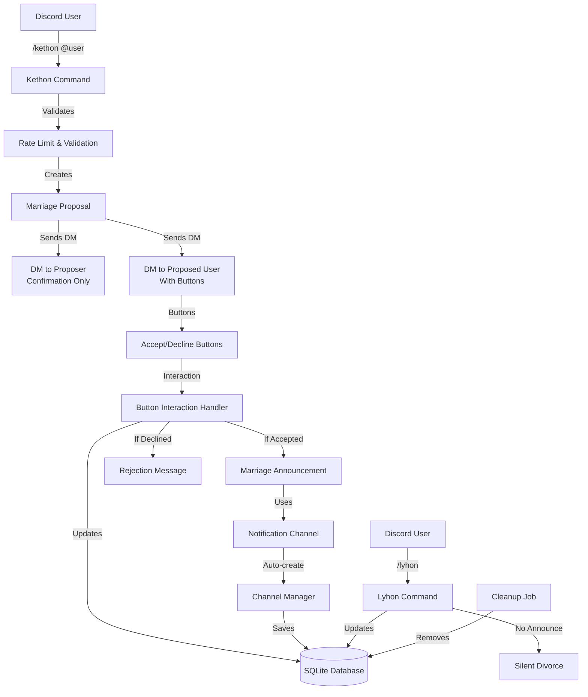

# System Design & Architecture

## Architecture Overview
**What is the high-level system structure?**



**Key components and their responsibilities:**
1. **Kethon Command**: Handles `/kethon @user` slash command, validates input, checks rate limits, creates proposal
2. **Proposal Manager**: Manages proposal state, sends DMs, handles button interactions
3. **Button Interaction Handler**: Processes accept/decline button clicks, checks button expiration
4. **Marriage Manager**: Manages active marriages, handles announcements
5. **Channel Manager**: Creates and manages notification channels per guild (default: "marriage-announcements")
6. **Lyhon Command**: Handles `/lyhon` command for ending marriages (unilateral or mutual consent)
7. **Rate Limiter**: Tracks and enforces proposal rate limits (1 per hour per user)
8. **Cleanup Service**: Removes expired/declined proposals after 7 days
9. **Database Layer**: Stores proposals, marriages, notification channels, and rate limit data

**Technology stack choices and rationale:**
- **Discord.js v14**: Button interactions, DM sending, channel management
- **better-sqlite3**: Store marriages, proposals, and channel configurations
- **TypeScript**: Type safety for complex state management
- **Existing bot infrastructure**: Leverage command and event handler systems

## Data Models
**What data do we need to manage?**

**Database Schema:**

```sql
-- Marriages table
CREATE TABLE IF NOT EXISTS marriages (
  id INTEGER PRIMARY KEY AUTOINCREMENT,
  user1_id TEXT NOT NULL,
  user2_id TEXT NOT NULL,
  guild_id TEXT NOT NULL,
  channel_id TEXT NOT NULL,
  married_at DATETIME DEFAULT CURRENT_TIMESTAMP,
  UNIQUE(user1_id, user2_id, guild_id)
);

-- Pending proposals table
CREATE TABLE IF NOT EXISTS proposals (
  id INTEGER PRIMARY KEY AUTOINCREMENT,
  proposer_id TEXT NOT NULL,
  proposed_id TEXT NOT NULL,
  guild_id TEXT NOT NULL,
  channel_id TEXT NOT NULL,
  proposed_accepted INTEGER DEFAULT 0,
  status TEXT DEFAULT 'pending',
  created_at DATETIME DEFAULT CURRENT_TIMESTAMP,
  button_expires_at DATETIME NOT NULL,
  UNIQUE(proposer_id, proposed_id, guild_id) WHERE status = 'pending'
);

-- Rate limiting: Track last proposal time per user per guild
CREATE TABLE IF NOT EXISTS proposal_rate_limits (
  user_id TEXT NOT NULL,
  guild_id TEXT NOT NULL,
  last_proposal_at DATETIME DEFAULT CURRENT_TIMESTAMP,
  PRIMARY KEY (user_id, guild_id)
);

-- Notification channels per guild
CREATE TABLE IF NOT EXISTS notification_channels (
  guild_id TEXT PRIMARY KEY,
  channel_id TEXT NOT NULL,
  created_at DATETIME DEFAULT CURRENT_TIMESTAMP
);
```

**Data flow between components:**
1. User executes `/kethon @user` → Command validates (rate limit, not self, not married) → Creates proposal record
2. Proposal created → Send confirmation DM to proposer (no buttons) → Send proposal DM to proposed user (with buttons) → Store proposal in database
3. Proposed user clicks accept/decline → Button handler checks expiration → Updates proposal state
4. If accepted: Create marriage record → Delete proposal → Announce in notification channel → Send confirmation DMs
5. If declined: Send anonymous rejection messages to both users → Delete proposal
6. User executes `/lyhon` → Check marriage exists → Delete marriage record → Send confirmation DMs (no announcement)
7. Cleanup job runs periodically → Removes declined/expired proposals older than 7 days

## API Design
**How do components communicate?**

**External APIs:**
- **Discord API**: Via discord.js library
  - Slash command interactions
  - Button interactions
  - DM sending
  - Channel creation and management
  - Message sending

**Internal interfaces:**
- **Marriage Service Interface**:
  ```typescript
  interface MarriageService {
    createProposal(proposerId: string, proposedId: string, guildId: string, channelId: string): Promise<Proposal>;
    checkRateLimit(userId: string, guildId: string): Promise<boolean>;
    handleProposalResponse(proposalId: string, userId: string, accepted: boolean): Promise<void>;
    checkButtonExpiration(proposalId: string): Promise<boolean>;
    getMarriage(userId: string, guildId: string): Promise<Marriage | null>;
    createMarriage(user1Id: string, user2Id: string, guildId: string, channelId: string): Promise<Marriage>;
    divorce(userId: string, guildId: string, mutual?: boolean): Promise<void>;
    cleanupExpiredProposals(): Promise<number>;
  }
  ```

- **Channel Manager Interface**:
  ```typescript
  interface ChannelManager {
    getOrCreateNotificationChannel(guildId: string, channelName?: string): Promise<string>;
    getNotificationChannel(guildId: string): Promise<string | null>;
  }
  ```
  
  Note: Default channel name is "marriage-announcements" if not specified.

**Request/response formats:**
- Slash commands: Discord interaction format
- Button interactions: Discord button interaction format
- DMs: Discord message format with embeds and action rows

**Authentication/authorization approach:**
- Discord handles user authentication
- Bot validates user permissions (can send DMs, create channels)
- No additional authentication needed

## Component Breakdown
**What are the major building blocks?**

**Backend services/modules:**
1. **src/commands/kethon.ts**: `/kethon @user` command implementation with rate limiting
2. **src/commands/lyhon.ts**: `/lyhon` command implementation for divorce
3. **src/services/marriageService.ts**: Core marriage logic and state management
4. **src/services/channelManager.ts**: Notification channel creation and management (default: "marriage-announcements")
5. **src/services/rateLimiter.ts**: Rate limiting service (1 proposal per hour per user)
6. **src/services/cleanupService.ts**: Proposal cleanup service (removes expired/declined proposals after 7 days)
7. **src/events/interactionCreate.ts**: Extended to handle button interactions
8. **src/database/migrations/marriage.ts**: Database schema for marriages

**Database/storage layer:**
- `marriages` table: Active marriages
- `proposals` table: Pending marriage proposals (status: 'pending', 'accepted', 'declined', 'expired')
- `proposal_rate_limits` table: Rate limiting data (last proposal time per user per guild)
- `notification_channels` table: Guild notification channel mappings

**Third-party integrations:**
- Discord.js: All Discord API interactions
- better-sqlite3: Database operations

## Design Decisions
**Why did we choose this approach?**

**Key architectural decisions and trade-offs:**

1. **Button-based proposal acceptance**
   - **Decision**: Use Discord buttons for accept/decline instead of commands
   - **Rationale**: Better UX, immediate feedback, no need to remember command syntax
   - **Trade-off**: Buttons expire after 15 minutes (Discord limitation), but acceptable for this use case

2. **Private DMs for proposals**
   - **Decision**: Send proposals via DM instead of channel
   - **Rationale**: Privacy, prevents spam, cleaner channel experience
   - **Trade-off**: Users with DMs disabled can't receive proposals (must handle gracefully)

3. **Automatic notification channel creation**
   - **Decision**: Auto-create channel if doesn't exist
   - **Rationale**: Seamless user experience, no admin setup required
   - **Trade-off**: Requires channel creation permissions, may create clutter if misused

4. **Database-driven state management**
   - **Decision**: Store proposals and marriages in database
   - **Rationale**: Persistence across bot restarts, can query state
   - **Trade-off**: Database complexity, but necessary for reliability

5. **Silent divorce (no announcements)**
   - **Decision**: Divorce doesn't send announcements
   - **Rationale**: Privacy, less drama, as specified by user
   - **Trade-off**: None - matches requirements

6. **Anonymous rejection messages**
   - **Decision**: Don't reveal who declined
   - **Rationale**: Privacy, prevents harassment
   - **Trade-off**: Less transparency, but better for user experience

7. **Rate limiting for proposals**
   - **Decision**: Track last proposal time per user per guild in database table
   - **Rationale**: Prevent spam, enforce 1 proposal per hour limit as per requirements
   - **Trade-off**: Additional database table and query overhead, but necessary for abuse prevention
   - **Implementation**: Check `proposal_rate_limits` table before creating proposal

8. **Proposer receives confirmation only**
   - **Decision**: Proposer gets confirmation DM without buttons
   - **Rationale**: Proposer already initiated proposal, only proposed user needs to respond
   - **Trade-off**: Simpler flow, matches requirements exactly
   - **Implementation**: Proposer DM contains: "You have proposed to @User. Waiting for their response..."

9. **Automatic proposal cleanup**
   - **Decision**: Clean up declined/expired proposals after 7 days via scheduled job
   - **Rationale**: Database hygiene, prevent accumulation of old data, matches requirements
   - **Trade-off**: Requires cleanup job (runs on bot startup and periodically), but keeps database manageable
   - **Implementation**: Query proposals with status 'declined' or 'expired' older than 7 days, delete them

10. **Button expiration tracking**
    - **Decision**: Store `button_expires_at` timestamp (created_at + 15 minutes) in proposals table
    - **Rationale**: Discord buttons expire after 15 minutes, need to track and handle gracefully
    - **Trade-off**: Additional field, but necessary for proper expiration handling
    - **Implementation**: Check expiration before processing button interaction, reject if expired

**Patterns and principles applied:**
- **Service Layer Pattern**: Separate business logic from command handlers
- **Repository Pattern**: Database operations abstracted
- **State Machine**: Proposal states (pending → accepted/declined)
- **Error Handling**: Graceful degradation (DM failures, permission issues)

## Non-Functional Requirements
**How should the system perform?**

**Performance targets:**
- Command response: < 500ms
- DM delivery: < 2 seconds
- Button interaction: < 200ms
- Database queries: < 100ms
- Channel creation: < 1 second

**Scalability considerations:**
- Database indexes on user_id and guild_id for fast lookups
  - Index on `marriages(user1_id, guild_id)` and `marriages(user2_id, guild_id)`
  - Index on `proposals(proposer_id, guild_id, status)` and `proposals(proposed_id, guild_id, status)`
  - Index on `proposal_rate_limits(user_id, guild_id)` (primary key)
- Proposal cleanup (remove expired/declined proposals after 7 days)
  - Scheduled cleanup job runs on bot startup and every 24 hours
  - Efficient batch deletion of old proposals
- Efficient query patterns (avoid N+1 queries)
- Rate limiting table keeps database small (one row per user per guild)

**Security requirements:**
- **Rate limiting**: Maximum 1 proposal per hour per user (enforced via `proposal_rate_limits` table)
  - Check before creating proposal
  - Update timestamp after successful proposal creation
- **Input validation**: 
  - Prevent self-marriage ("You cannot propose to yourself!")
  - Prevent bot-marriage ("You cannot propose to a bot!")
  - Prevent duplicate proposals (check existing pending proposals)
  - Check if users are already married (both proposer and proposed)
- **SQL injection prevention**: All queries use prepared statements (better-sqlite3 enforces this)
- **Spam prevention**: Rate limiting + duplicate proposal checks
- **Privacy**: Anonymous rejection messages, no revealing who declined
- **Permission checks**: 
  - Bot can send DMs (handle gracefully if not)
  - Bot can create channels (handle gracefully if not)
  - Bot can send messages in notification channel

**Reliability/availability needs:**
- Handle DM failures gracefully (user has DMs disabled)
  - Send error message in command channel if DM fails
  - Don't create proposal if DM to proposed user fails
- Handle missing channels (channel deleted by admin)
  - Recreate notification channel on next announcement
  - Fallback to command channel if notification channel creation fails
- Handle missing permissions (bot can't create channels)
  - Send clear error message to user
  - Log permission errors for admin awareness
- Proposal state recovery (if bot restarts during pending proposal)
  - All state stored in database, proposals persist across restarts
  - Buttons may expire, but proposal record remains until cleaned up
- Database transaction safety (atomic operations)
  - Use transactions for multi-step operations (proposal creation, marriage creation)
  - Rollback on errors to maintain consistency
- Button expiration handling
  - Check `button_expires_at` before processing button interaction
  - Reject expired button clicks with helpful message: "This proposal has expired. Please ask them to propose again."
- Cleanup job reliability
  - Run cleanup on bot startup to remove stale data
  - Schedule periodic cleanup (every 24 hours) for ongoing maintenance

