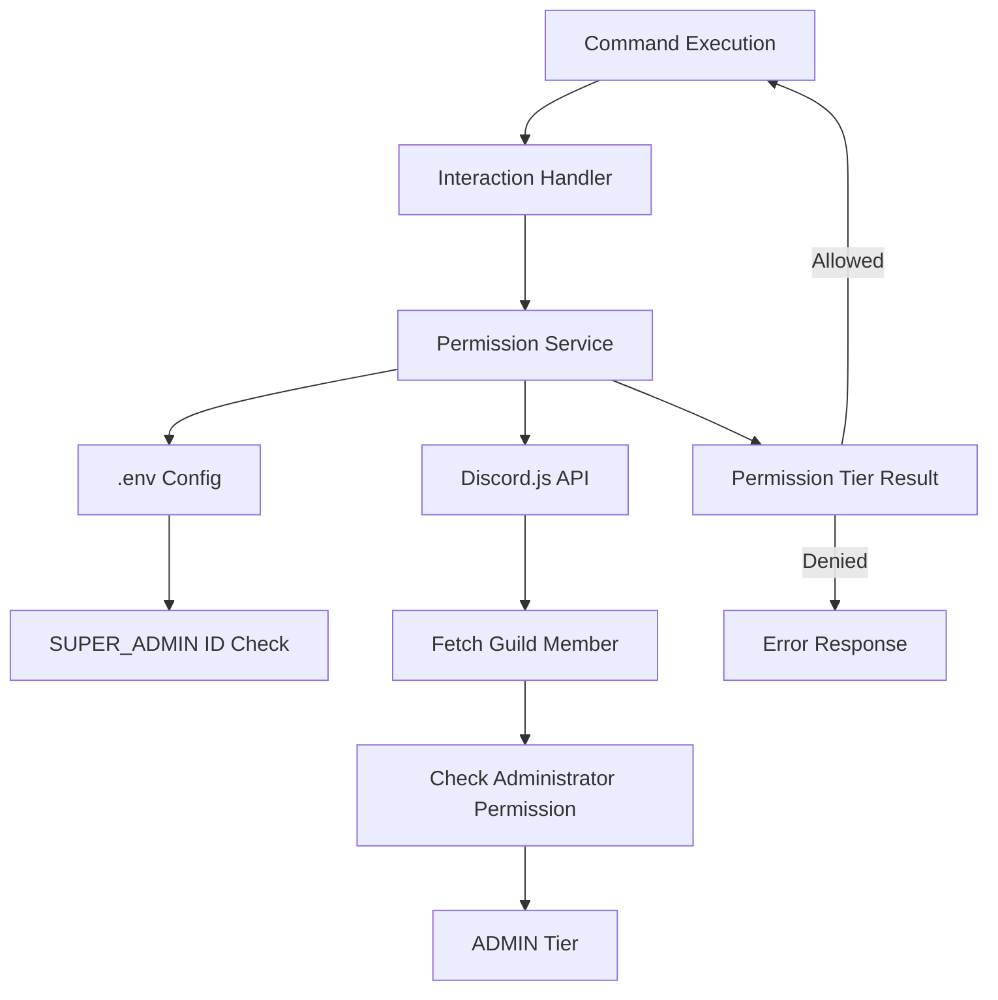

# System Design & Architecture

## Architecture Overview
**What is the high-level system structure?**



**Key components and their responsibilities:**
- **PermissionService**: Central service that determines user permission tier
- **Command Middleware**: Wrapper/decorator pattern to apply permission checks to commands
- **Environment Config**: Reads SUPER_ADMIN from .env
- **Discord Permission Checker**: Checks if user has Administrator permission flag in the guild

**Technology stack choices and rationale:**
- **TypeScript**: Existing codebase language
- **Discord.js**: Existing library for Discord API interactions
- **dotenv**: Already in use for environment configuration
- No new dependencies required

## Data Models
**What data do we need to manage?**

**Permission Tiers (Enum):**
```typescript
enum PermissionTier {
  SUPER_ADMIN = 'SUPER_ADMIN',
  ADMIN = 'ADMIN',
  USER = 'USER',
  NONE = 'NONE'
}
```

**Permission Configuration:**
- SUPER_ADMIN: Stored in .env as `SUPER_ADMIN=<discord_user_id>`
- ADMIN: Determined by Discord's built-in "Administrator" permission flag (checked via `member.permissions.has(Administrator)`)
- USER: Default tier for all users (anyone without Administrator permission can use USER-tier commands)

**No database storage required** - all permissions are determined at runtime from:
1. Environment variables (SUPER_ADMIN)
2. Discord's built-in Administrator permission flag (checked via `member.permissions.has(Administrator)`)
3. Default USER tier for all users without Administrator permission

**Data flow:**
1. Command receives interaction
2. Permission service extracts user ID and guild
3. Checks if user is SUPER_ADMIN (from .env) - synchronous check
4. If not SUPER_ADMIN, checks if user has Administrator permission in the guild - async check
5. If not ADMIN, user defaults to USER tier (all users can use USER-tier commands)
6. Returns permission tier result
7. Command proceeds or returns error based on required tier

## API Design
**How do components communicate?**

**PermissionService Interface:**
```typescript
class PermissionService {
  // Get user's permission tier in a guild
  getUserTier(userId: string, guild: Guild | null): Promise<PermissionTier>
  
  // Check if user has required tier or higher (hierarchical: SUPER_ADMIN > ADMIN > USER)
  hasPermission(userId: string, guild: Guild | null, requiredTier: PermissionTier): Promise<boolean>
  
  // Check if user is SUPER_ADMIN (synchronous, checks .env)
  isSuperAdmin(userId: string): boolean
  
  // Check if member has Administrator permission (async, requires guild member)
  hasAdministratorPermission(member: GuildMember | null): boolean
}
```

**Command Integration:**
- Commands can specify required permission tier in their metadata
- Permission check happens before command execution
- Returns user-friendly error if permission denied

**Internal interfaces:**
- Permission checks are synchronous for SUPER_ADMIN (env lookup, <1ms)
- Permission checks are async for Administrator permission check (requires fetching guild member, <50ms)
- USER tier is default - no check needed (all users have USER tier access)

## Command Permission Mapping
**Which commands require which permission tier?**

**ADMIN tier commands** (require Administrator permission):
- `/diemdanh` - Take attendance of users in voice channels
- `/checkdd` - Check attendance records for a specific date
- `/ping` - Test bot responsiveness

**USER tier commands** (default, all users can access):
- `/kethon` - Propose marriage to another user
- `/lyhon` - Divorce (end marriage)
- `/status` - Check user status and marriage information

**Permission hierarchy:**
- SUPER_ADMIN can execute all commands (ADMIN and USER tier)
- ADMIN can execute ADMIN and USER tier commands
- USER can only execute USER tier commands

## Component Breakdown
**What are the major building blocks?**

**1. Permission Service (`src/services/permissionService.ts`)**
- Core permission checking logic
- SUPER_ADMIN validation from .env
- Discord Administrator permission checking for ADMIN tier (using `PermissionsBitField.Flags.Administrator`)
- USER tier is default for all users without Administrator permission

**2. Environment Configuration (`src/config/env.ts`)**
- Add `getSuperAdminId()` function
- Validate SUPER_ADMIN format (Discord user ID)

**3. Command Middleware/Helper**
- Permission check wrapper function
- Can be used as decorator or utility function
- Returns standardized error messages

**4. Updated Command Structure**
- Commands add `requiredPermission` property to metadata
- Commands use permission check before execution
- All existing commands updated with appropriate tiers

**5. Updated Interaction Handler (`src/events/interactionCreate.ts`)**
- Apply permission checks before command execution
- Handle permission denied errors gracefully

## Design Decisions
**Why did we choose this approach?**

**1. Service-based architecture:**
- Centralizes permission logic for maintainability
- Easy to test and modify
- Follows existing service pattern in codebase

**2. Environment-based SUPER_ADMIN:**
- Simple configuration without database
- Easy to change without code deployment
- Follows existing .env pattern

**3. Permission-based ADMIN:**
- Leverages Discord's native permission system (Administrator flag)
- No database storage needed
- Server administrators can manage via Discord role permissions UI
- More flexible than role name matching - works with any role that has Administrator permission

**4. Hierarchical permission system:**
- SUPER_ADMIN > ADMIN > USER > NONE
- Higher tiers automatically have access to lower tier commands
- Simplifies permission logic

**5. No database schema changes:**
- Keeps implementation simple
- No migration needed
- Permissions are runtime-determined

**Alternatives considered:**
- **Database-stored permissions**: More flexible but adds complexity and migration
- **Command-level permission config**: More granular but harder to maintain
- **Role name matching**: Less flexible, requires exact role names
- **Discord permission overwrites**: More complex and server-specific
- **Chose Administrator permission flag**: Most flexible, uses Discord's built-in permission system

**Patterns and principles applied:**
- Single Responsibility Principle (PermissionService handles only permissions)
- DRY (reusable permission checking)
- Fail-fast (check permissions early, before command logic)

## Non-Functional Requirements
**How should the system perform?**

**Performance targets:**
- Permission check overhead: <50ms per command
- SUPER_ADMIN check: <1ms (synchronous env lookup)
- Role check: <50ms (async Discord API call, can be cached)

**Scalability considerations:**
- Permission checks are stateless (no shared state)
- Can handle multiple concurrent permission checks
- Administrator permission check uses Discord.js member cache when available
- No role name matching overhead (uses built-in permission flags)

**Security requirements:**
- SUPER_ADMIN ID validation (must be valid Discord user ID format)
- Administrator permission check uses Discord's trusted permission system
- Permission checks must happen server-side (client cannot bypass)
- Error messages should not leak sensitive information (no internal tier names exposed)
- Bot must have "View Server Members" permission to check user permissions

**Reliability/availability needs:**
- Graceful degradation if Discord API fails (fallback to error message, don't allow unauthorized access)
- Handle missing .env SUPER_ADMIN gracefully (log warning, continue with permission-based checks only)
- Handle missing guild gracefully (DM context - only SUPER_ADMIN can execute, others get clear error)
- Handle bot lacking "View Server Members" permission (return clear error to user)
- Handle member not found (user left server) - return permission denied

