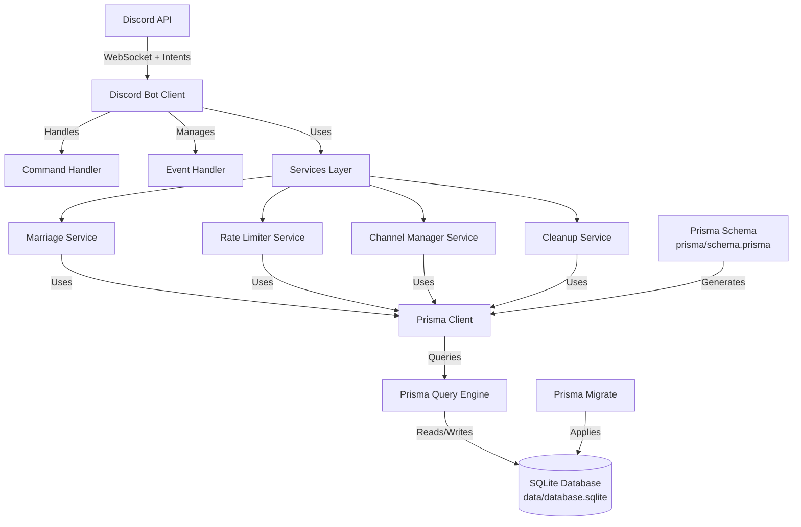
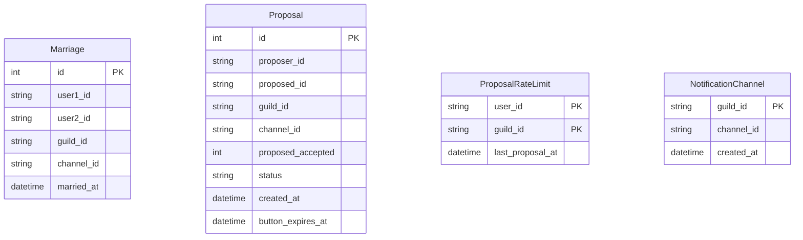

# System Design & Architecture

## Architecture Overview
**What is the high-level system structure?**



**Key components and their responsibilities:**
1. **Prisma Schema** (`prisma/schema.prisma`): Defines data models, relationships, and database configuration
2. **Prisma Client**: Generated TypeScript client for type-safe database access
3. **Prisma Migrate**: Manages database schema migrations
4. **Services Layer**: All existing services (marriage, rateLimiter, channelManager, cleanup) now use Prisma Client instead of raw SQL
5. **Database**: SQLite database (unchanged location: `data/database.sqlite`)

**Technology stack choices and rationale:**
- **Prisma ORM**: Modern ORM with excellent TypeScript support, type safety, and migration management
- **SQLite**: Maintained (same database engine, just different access layer)
- **Prisma Migrate**: Automatic schema versioning and migration generation
- **Prisma Client**: Type-safe database queries with autocomplete and compile-time error checking

## Data Models
**What data do we need to manage?**

**Core entities and their relationships:**



**Note**: These tables are independent (no foreign key relationships). Relationships are logical/conceptual:
- Users can have multiple proposals over time (tracked via `proposer_id`/`proposed_id`)
- Rate limits track proposal frequency per user/guild
- Notification channels are referenced by `guild_id` in marriages and proposals

**Data schemas/structures:**

All tables from current system:
1. **marriages**: Stores active marriages between two users in a guild
2. **proposals**: Stores marriage proposals (pending, accepted, declined, expired)
3. **proposal_rate_limits**: Tracks when users last made proposals (1 per hour limit)
4. **notification_channels**: Stores Discord channel IDs for marriage announcements per guild

**Data flow between components:**
- Services use Prisma Client to query/update database
- Prisma Client translates TypeScript calls to SQL queries
- Prisma Query Engine executes queries against SQLite
- Results are returned as typed TypeScript objects

## API Design
**How do components communicate?**

**Prisma Schema Definition** (`prisma/schema.prisma`):

```prisma
generator client {
  provider = "prisma-client-js"
}

datasource db {
  provider = "sqlite"
  url      = env("DATABASE_URL")
}

// In .env file: DATABASE_URL="file:./data/database.sqlite"
// Or use absolute path: DATABASE_URL="file:/absolute/path/to/data/database.sqlite"

model Marriage {
  id         Int      @id @default(autoincrement())
  user1Id    String   @map("user1_id")
  user2Id    String   @map("user2_id")
  guildId    String   @map("guild_id")
  channelId  String   @map("channel_id")
  marriedAt  DateTime @default(now()) @map("married_at")

  @@unique([user1Id, user2Id, guildId])
  @@index([user1Id, guildId])
  @@index([user2Id, guildId])
  @@map("marriages")
}

model Proposal {
  id              Int      @id @default(autoincrement())
  proposerId      String   @map("proposer_id")
  proposedId      String   @map("proposed_id")
  guildId         String   @map("guild_id")
  channelId       String   @map("channel_id")
  proposedAccepted Int     @default(0) @map("proposed_accepted")
  status          String   @default("pending")
  createdAt       DateTime @default(now()) @map("created_at")
  buttonExpiresAt DateTime @map("button_expires_at")

  @@index([proposerId, guildId, status])
  @@index([proposedId, guildId, status])
  @@index([status, createdAt])
  @@map("proposals")
}

model ProposalRateLimit {
  userId          String   @map("user_id")
  guildId         String   @map("guild_id")
  lastProposalAt  DateTime @default(now()) @map("last_proposal_at")

  @@id([userId, guildId])
  @@map("proposal_rate_limits")
}

model NotificationChannel {
  guildId    String   @id @map("guild_id")
  channelId  String   @map("channel_id")
  createdAt  DateTime @default(now()) @map("created_at")

  @@map("notification_channels")
}
```

**Internal interfaces:**
- Services continue to use the same public methods (no breaking changes)
- Internal implementation changes from raw SQL to Prisma Client calls
- Prisma Client provides type-safe query methods: `findMany`, `findUnique`, `create`, `update`, `delete`, `upsert`, etc.

**Request/response formats:**
- Prisma returns typed objects matching the schema models
- No changes to service return types (interfaces remain the same)
- Prisma types are generated: `Marriage`, `Proposal`, `ProposalRateLimit`, `NotificationChannel`
- Services can use Prisma types directly or map to existing interfaces

**Error handling:**
- Prisma throws specific error types:
  - `PrismaClientKnownRequestError`: Unique constraint violations, foreign key errors
  - `PrismaClientValidationError`: Invalid input data
  - `PrismaClientInitializationError`: Connection/initialization failures
- Services should catch and handle Prisma errors appropriately
- Map Prisma errors to existing error messages for consistency

## Component Breakdown
**What are the major building blocks?**

**Backend services/modules:**
1. **MarriageService** (`src/services/marriageService.ts`)
   - Migrate all SQL queries to Prisma Client
   - Methods: `createProposal`, `acceptProposal`, `declineProposal`, `getMarriage`, `divorce`, etc.
   - Use Prisma transactions for multi-step operations (e.g., creating marriage + deleting proposal)
   - Example migration pattern:
     ```typescript
     // Old: db.prepare('SELECT * FROM marriages WHERE ...').get(...)
     // New: prisma.marriage.findFirst({ where: { ... } })
     ```

2. **RateLimiterService** (`src/services/rateLimiter.ts`)
   - Migrate rate limit checks and updates to Prisma
   - Methods: `checkRateLimit`, `updateRateLimit`, `getTimeUntilNextProposal`
   - Use `upsert` for rate limit updates (create or update)
   - Example: `prisma.proposalRateLimit.upsert({ where: {...}, update: {...}, create: {...} })`

3. **ChannelManagerService** (`src/services/channelManager.ts`)
   - Migrate channel lookup and storage to Prisma
   - Methods: `getOrCreateNotificationChannel`, `getNotificationChannel`
   - Use `upsert` for channel storage
   - Example: `prisma.notificationChannel.upsert({ where: { guildId }, update: {...}, create: {...} })`

4. **CleanupService** (`src/services/cleanupService.ts`)
   - Migrate cleanup queries to Prisma
   - Methods: `cleanupExpiredProposals`, `markExpiredProposals`
   - Use `deleteMany` and `updateMany` for bulk operations
   - Example: `prisma.proposal.deleteMany({ where: { status: 'declined', createdAt: { lt: ... } } })`

**Database/storage layer:**
1. **Prisma Client** (`src/database/prisma.ts`)
   - Singleton instance of PrismaClient
   - Exported for use by all services
   - Handles connection lifecycle automatically
   - Example structure:
     ```typescript
     import { PrismaClient } from '@prisma/client';
     
     const prisma = new PrismaClient({
       log: process.env.NODE_ENV === 'development' ? ['query', 'error', 'warn'] : ['error'],
     });
     
     export default prisma;
     ```
   
2. **Prisma Migrations** (`prisma/migrations/`)
   - Initial migration to create all tables
   - Future migrations for schema changes
   - Migration strategy:
     - **Fresh database**: Use `prisma migrate dev --name init`
     - **Existing database**: Use `prisma db push` or baseline migration
     - **Production**: Use `prisma migrate deploy`

3. **Database initialization** (`src/index.ts`)
   - Remove `initializeMarriageSchema()` function
   - Run Prisma migrations on startup (or use `prisma migrate deploy` in production)
   - Prisma Client auto-connects on first query (no explicit `connect()` needed)
   - Graceful shutdown: `await prisma.$disconnect()` on SIGINT/SIGTERM

4. **Prisma Studio** (Development tool)
   - Visual database browser: `npx prisma studio`
   - Useful for debugging and manual data inspection
   - Accessible at http://localhost:5555

**Third-party integrations:**
- Prisma (ORM and migration tool)
- SQLite (unchanged)

## Design Decisions
**Why did we choose this approach?**

**Key architectural decisions and trade-offs:**

1. **Prisma Client Singleton Pattern**
   - **Decision**: Create a singleton PrismaClient instance
   - **Rationale**: Prisma recommends one instance per application, and our current codebase uses singleton pattern
   - **Trade-off**: Slightly different from Prisma's typical pattern, but maintains consistency with existing codebase

2. **Maintain Existing Service Interfaces**
   - **Decision**: Keep all service public methods unchanged
   - **Rationale**: Zero breaking changes, easier migration, existing code continues to work
   - **Trade-off**: Internal implementation changes but external API stays the same

3. **Prisma Migrate for Schema Management**
   - **Decision**: Use Prisma Migrate instead of manual SQL migrations
   - **Rationale**: Automatic migration generation, versioning, rollback support
   - **Trade-off**: Learning curve, but better long-term maintainability

4. **Field Name Mapping (snake_case to camelCase)**
   - **Decision**: Use Prisma's `@map` to keep database columns as snake_case, Prisma models as camelCase
   - **Rationale**: Follows TypeScript conventions while maintaining database compatibility
   - **Trade-off**: Slight complexity in schema, but better developer experience

5. **Keep SQLite File Location**
   - **Decision**: Maintain `data/database.sqlite` location
   - **Rationale**: No need to change existing data location, easier migration
   - **Trade-off**: None, straightforward decision

**Alternatives considered:**

1. **TypeORM**: More mature but heavier, less TypeScript-native
2. **Drizzle ORM**: Lightweight but less feature-rich, smaller ecosystem
3. **Keep better-sqlite3**: Current approach, but lacks type safety and migration management
4. **Sequelize**: Older ORM, less modern TypeScript support

**Patterns and principles applied:**

- **Single Responsibility**: Each service handles its domain
- **Dependency Injection**: Services depend on Prisma Client (can be mocked for testing)
- **Type Safety**: Leverage Prisma's generated types throughout
- **Migration Strategy**: Use Prisma Migrate for versioned schema changes
- **Transaction Support**: Use Prisma's `$transaction()` for multi-step operations
- **Connection Management**: Prisma handles connection pooling automatically (though SQLite doesn't need it)

**ESM Module Compatibility:**
- Prisma Client works with ESM (`"type": "module"`)
- Import Prisma Client using ESM syntax: `import prisma from './database/prisma.js'`
- Prisma generates ESM-compatible client by default

## Non-Functional Requirements
**How should the system perform?**

**Performance targets:**
- Database queries should maintain similar or better performance than raw SQL
- Prisma Client overhead should be minimal (<10ms per query)
- Startup time should not increase significantly (Prisma Client generation is fast)
- Memory usage should remain reasonable (Prisma Client is lightweight)

**Scalability considerations:**
- SQLite is suitable for single-instance Discord bot (current use case)
- Prisma supports connection pooling (though SQLite doesn't need it)
- If scaling to multiple bot instances, would need to migrate to PostgreSQL/MySQL
- Current architecture supports future database migration if needed

**Security requirements:**
- Prisma provides SQL injection protection through parameterized queries
- Input validation remains in service layer (unchanged)
- Database file permissions should remain restricted (unchanged)
- No new security concerns introduced

**Reliability/availability needs:**
- Prisma migrations should be idempotent and safe to run multiple times
- Error handling should be improved with Prisma's error types
- Transaction support through Prisma's `$transaction()` API for atomic operations
- Backup strategy remains the same (backup SQLite file)
- Prisma Client handles connection lifecycle automatically
- Graceful shutdown: Call `prisma.$disconnect()` on bot shutdown
- Connection retry: Prisma automatically retries failed connections
- Migration rollback: Use `prisma migrate resolve --rolled-back <migration_name>` if needed

**Migration Strategy for Existing Database:**
- **If database is empty**: Use `prisma migrate dev` to create fresh schema
- **If database has data**: 
  1. Backup existing database first
  2. Use `prisma db push` to sync schema without migrations (development)
  3. Or create baseline migration: `prisma migrate dev --create-only`, then mark as applied
  4. Verify data integrity after migration
- **Production**: Always use `prisma migrate deploy` (applies pending migrations)

