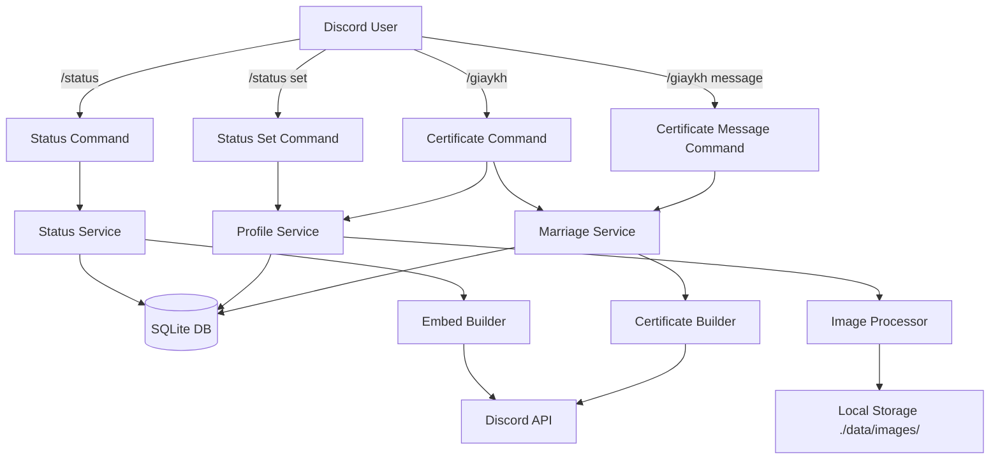
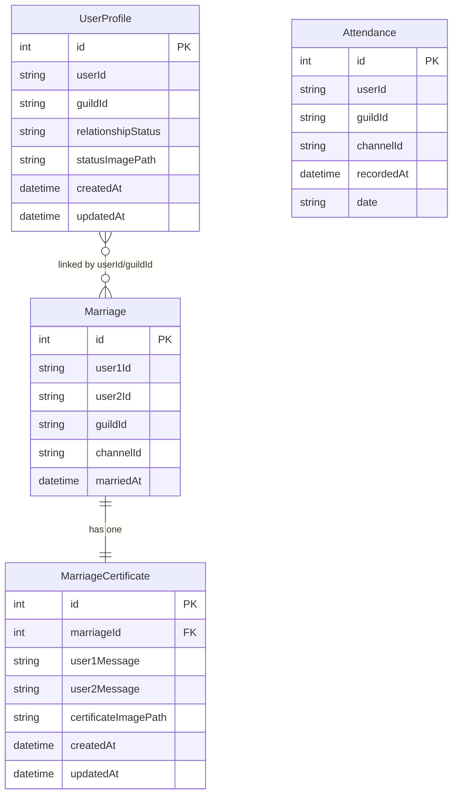

# System Design & Architecture

## Architecture Overview
**What is the high-level system structure?**



### Key components and their responsibilities

1. **Commands Layer**
   - `status.ts` - View user status (existing, modified)
   - `statusSet.ts` - NEW: Set relationship status
   - `statusImage.ts` - NEW: Upload status image
   - `giaykh.ts` - NEW: View marriage certificate
   - `giaykhMessage.ts` - NEW: Set certificate message
   - `giaykhImage.ts` - NEW: Set certificate image

2. **Services Layer**
   - `statusService.ts` - Existing, modified to include custom status
   - `profileService.ts` - NEW: Manage user profiles (status, images)
   - `marriageService.ts` - Existing, extended with certificate data
   - `imageService.ts` - NEW: Handle image upload, validation, cropping

3. **Data Layer**
   - `prisma.ts` - Database client (existing)
   - New models: `UserProfile`, `MarriageCertificate`

### Technology stack choices and rationale

- **TypeScript** - Type safety, existing codebase standard
- **Discord.js** - Discord bot framework (existing)
- **Prisma ORM** - Database abstraction (existing)
- **SQLite** - Lightweight database (existing)
- **Sharp** (NEW) - Image processing library for cropping/resizing
- **Node.js** - Runtime environment (existing)

## Data Models
**What data do we need to manage?**

### Core entities and their relationships



### Data schemas/structures

#### New Model: UserProfile
```prisma
model UserProfile {
  id                 Int      @id @default(autoincrement())
  userId             String   @map("user_id")
  guildId            String   @map("guild_id")
  relationshipStatus String   @default("single") @map("relationship_status")
  statusImagePath    String?  @map("status_image_path")
  createdAt          DateTime @default(now()) @map("created_at")
  updatedAt          DateTime @updatedAt @map("updated_at")

  @@unique([userId, guildId])
  @@index([userId, guildId])
  @@map("user_profiles")
}
```

#### New Model: MarriageCertificate
```prisma
model MarriageCertificate {
  id                    Int      @id @default(autoincrement())
  marriageId            Int      @unique @map("marriage_id")
  user1Message          String?  @map("user1_message")
  user2Message          String?  @map("user2_message")
  certificateImagePath  String?  @map("certificate_image_path")
  createdAt             DateTime @default(now()) @map("created_at")
  updatedAt             DateTime @updatedAt @map("updated_at")

  marriage Marriage @relation(fields: [marriageId], references: [id], onDelete: Cascade)

  @@map("marriage_certificates")
}
```

#### Modified Model: Marriage
```prisma
// Add relation to certificate
model Marriage {
  id         Int      @id @default(autoincrement())
  user1Id    String   @map("user1_id")
  user2Id    String   @map("user2_id")
  guildId    String   @map("guild_id")
  channelId  String   @map("channel_id")
  marriedAt  DateTime @default(now()) @map("married_at")
  
  certificate MarriageCertificate? // NEW: One-to-one relation

  @@unique([user1Id, user2Id, guildId])
  @@index([user1Id, guildId])
  @@index([user2Id, guildId])
  @@map("marriages")
}
```

### Data flow between components

1. **Status Update Flow:**
   ```
   User → /status set → ProfileService.setStatus() → UserProfile table → Success response
   ```

2. **Image Upload Flow:**
   ```
   User → /status image [file] → ImageService.processImage() → Sharp (crop to 480x480) 
   → Save to local storage → Save file path to UserProfile → Success response
   ```

3. **Status View Flow:**
   ```
   User → /status → StatusService.getUserStatus() → Join UserProfile + Marriage + Attendance 
   → Load image from storage → Format embed → Display to user
   ```

4. **Certificate View Flow:**
   ```
   User → /giaykh → MarriageService.getMarriage() → Join MarriageCertificate 
   → Load image from storage → Calculate days married → Format certificate embed → Display to user
   ```

## API Design
**How do components communicate?**

### Command Interfaces

#### Status Commands
```typescript
// View status (existing, modified)
/status [user: User?]

// NEW: Set relationship status
/status set <status: "single" | "complicated" | "married" | "dating">

// NEW: Upload status image
/status image <image: Attachment>
```

#### Certificate Commands
```typescript
// NEW: View marriage certificate
/giaykh [user: User?]

// NEW: Set personal message
/giaykh message <message: String>

// NEW: Set certificate image
/giaykh image <image: Attachment>
```

### Service Interfaces

#### ProfileService
```typescript
interface ProfileService {
  // Get or create user profile
  getProfile(userId: string, guildId: string): Promise<UserProfile>;
  
  // Set relationship status
  setStatus(userId: string, guildId: string, status: RelationshipStatus): Promise<UserProfile>;
  
  // Set status image (stores file path)
  setStatusImage(userId: string, guildId: string, imagePath: string): Promise<UserProfile>;
  
  // Get profile with all related data
  getFullProfile(userId: string, guildId: string): Promise<FullProfile>;
}

type RelationshipStatus = "single" | "complicated" | "married" | "dating";

interface FullProfile {
  profile: UserProfile;
  marriage: Marriage | null;
  attendance: AttendanceStats | null;
}
```

#### ImageService
```typescript
interface ImageService {
  // Process and save image to local storage
  processImage(attachment: Attachment, targetSize: number): Promise<string>;
  
  // Validate image
  validateImage(attachment: Attachment): Promise<boolean>;
  
  // Crop image to square
  cropToSquare(buffer: Buffer, size: number): Promise<Buffer>;
  
  // Save image to local storage
  saveToStorage(buffer: Buffer, filename: string): Promise<string>;
  
  // Load image from storage
  loadFromStorage(filepath: string): Promise<Buffer>;
}
```

#### MarriageService (Extended)
```typescript
interface MarriageService {
  // Existing methods...
  
  // NEW: Get certificate data
  getCertificate(marriageId: number): Promise<MarriageCertificate | null>;
  
  // NEW: Set user message
  setUserMessage(marriageId: number, userId: string, message: string): Promise<void>;
  
  // NEW: Set certificate image (stores file path)
  setCertificateImage(marriageId: number, imagePath: string): Promise<void>;
  
  // NEW: Calculate marriage duration
  calculateMarriageDuration(marriedAt: Date): { days: number; formatted: string };
}
```

### Request/response formats

#### Status Embed Format
```typescript
// Images are loaded from local storage and attached to Discord message
const imageBuffer = await imageService.loadFromStorage(statusImagePath);
const attachment = new AttachmentBuilder(imageBuffer, { name: 'status.jpg' });

{
  title: "Thông tin của tôi",
  color: 0x5865f2,
  thumbnail: { url: userAvatarUrl },
  description: `
    ${emoji} **Gia nhập LHT:**
    ${joinDate}
    
    ${emoji} **Điểm danh:**
    • Bang chiến: ${totalDays} ngày
    • Lần đây nhất: ${lastDate}
    
    ${emoji} **Trạng thái:**
    ${relationshipStatus}
    
    Soo cute<333
  `,
  image: { url: 'attachment://status.jpg' }, // NEW: Custom image from local storage
  footer: { text: guildName },
  timestamp: now
}
```

#### Certificate Embed Format
```typescript
// Images are loaded from local storage and attached to Discord message
const imageBuffer = await imageService.loadFromStorage(certificateImagePath);
const attachment = new AttachmentBuilder(imageBuffer, { name: 'certificate.jpg' });

{
  title: "💒 Giấy Kết Hôn 💒",
  color: 0xff69b4,
  description: `
    **Ngày kết hôn:** ${marriageDate}
    **Thời gian:** ${daysMarried} ngày
    
    ---
    
    💌 **Lời nhắn từ ${user1Name}:**
    "${user1Message || 'Chưa có lời nhắn'}"
    
    💌 **Lời nhắn từ ${user2Name}:**
    "${user2Message || 'Chưa có lời nhắn'}"
  `,
  image: { url: 'attachment://certificate.jpg' }, // NEW: Custom certificate image from local storage
  footer: { text: `${user1Name} ❤️ ${user2Name}` },
  timestamp: now
}
```

## Component Breakdown
**What are the major building blocks?**

### New Commands (5 total)
1. **statusSet.ts** - Set relationship status
2. **statusImage.ts** - Upload status image
3. **giaykh.ts** - View marriage certificate
4. **giaykhMessage.ts** - Set certificate message
5. **giaykhImage.ts** - Set certificate image

### Modified Commands (1 total)
1. **status.ts** - Updated to show custom status and image

### New Services (2 total)
1. **profileService.ts** - User profile management
2. **imageService.ts** - Image processing and validation

### Modified Services (2 total)
1. **statusService.ts** - Extended to include profile data
2. **marriageService.ts** - Extended with certificate functionality

### Database Changes
1. **New migration** - Add UserProfile table
2. **New migration** - Add MarriageCertificate table
3. **New migration** - Add relation to Marriage table

### Utilities
1. **imageProcessor.ts** - Sharp integration for image manipulation
2. **validators.ts** - Image validation helpers

## Design Decisions
**Why did we choose this approach?**

### 1. Separate UserProfile Table
**Decision:** Create a new `UserProfile` table instead of adding columns to existing tables.

**Rationale:**
- ✅ Clean separation of concerns
- ✅ Doesn't pollute Marriage or Attendance tables
- ✅ Easy to extend with future profile features
- ✅ One profile per user per guild (proper normalization)

**Alternatives considered:**
- ❌ Add columns to User table (no User table exists)
- ❌ Add to Marriage table (not all users are married)
- ❌ Store in JSON field (harder to query)

### 2. Separate MarriageCertificate Table
**Decision:** Create dedicated table for certificate data instead of adding to Marriage table.

**Rationale:**
- ✅ Marriage table stays focused on core marriage data
- ✅ Certificate data is optional and can be null
- ✅ Easy to add future fields (points, streaks)
- ✅ One-to-one relation is clear and explicit

**Alternatives considered:**
- ❌ Add columns to Marriage table (table becomes bloated)
- ❌ Store messages in separate table (over-normalized)

### 3. Self-Hosted Image Storage
**Decision:** Store images on the bot's server/storage and serve them directly.

**Rationale:**
- ✅ Full control over image storage and serving
- ✅ No external dependencies
- ✅ Can implement custom image optimization
- ✅ Privacy - images not uploaded to third-party services

**Alternatives considered:**
- ❌ Discord CDN (URL persistence concerns, requires upload channel)
- ❌ Imgur API (rate limits, external dependency)
- ❌ Base64 in database (size limits, performance issues)

### 4. Sharp for Image Processing
**Decision:** Use Sharp library for image manipulation.

**Rationale:**
- ✅ Fast, production-ready library
- ✅ Supports all common formats
- ✅ Simple API for cropping/resizing
- ✅ Low memory footprint

**Alternatives considered:**
- ❌ Jimp (slower, JavaScript-based)
- ❌ Canvas (more complex API)
- ❌ ImageMagick (external dependency)

### 5. Separate Commands for Set Operations
**Decision:** Create separate commands for setting status, images, messages.

**Rationale:**
- ✅ Clear, focused commands
- ✅ Easier to implement and test
- ✅ Better Discord autocomplete UX
- ✅ Follows single responsibility principle

**Alternatives considered:**
- ❌ Single `/profile` command with subcommands (more complex)
- ❌ Modal forms (requires button interaction)

### 6. Status Independence from Marriage
**Decision:** Relationship status is completely independent of actual marriages.

**Rationale:**
- ✅ User freedom to express real-world status
- ✅ Reduces confusion between game marriage and real status
- ✅ Allows for roleplay scenarios
- ✅ Matches user requirement

**Alternatives considered:**
- ❌ Auto-sync status with marriage (removes user control)
- ❌ Validate status matches marriage (too restrictive)

## Non-Functional Requirements
**How should the system perform?**

### Performance targets
- Status command: < 2 seconds response time
- Image upload: < 5 seconds processing time
- Certificate generation: < 2 seconds response time
- Database queries: < 100ms per query
- Image processing: < 3 seconds for 480x480 crop

### Scalability considerations
- Image size limit: 8MB (Discord limit)
- Message length limit: 500 characters per certificate message
- Profile cache: Consider caching frequently accessed profiles
- Local storage: Monitor disk usage and implement cleanup strategy
- Storage path: ./data/images/ with subdirectories for organization
- Database indexes: Ensure proper indexes on userId + guildId

### Security requirements
- **Input validation:** Validate all user inputs (status enum, image format, message length)
- **Image validation:** Check file type, size, dimensions before processing
- **Path validation:** Validate file paths to prevent directory traversal attacks
- **File permissions:** Ensure proper file system permissions (644 for files, 755 for directories)
- **SQL injection:** Use Prisma parameterized queries (already handled)
- **XSS prevention:** Sanitize user messages before display
- **Authorization:** Users can only modify their own profile/messages

### Reliability/availability needs
- **Error handling:** Graceful fallbacks for missing images
- **Default values:** Provide sensible defaults (single status, no image)
- **Data integrity:** Foreign key constraints ensure referential integrity
- **Rollback support:** Database migrations should be reversible
- **Logging:** Log all image processing errors for debugging
- **Rate limiting:** Prevent spam of status/image updates (consider 1 update per minute)

## Storage Management Strategy

### Directory Structure
```
data/
├── database.sqlite
└── images/
    ├── status/
    │   ├── {timestamp}-{random}.jpg
    │   └── ...
    └── certificates/
        ├── {timestamp}-{random}.jpg
        └── ...
```

### Image Serving Mechanism
Images stored locally are served through Discord attachments:

1. **Load image from storage:**
   ```typescript
   const imageBuffer = await imageService.loadFromStorage(imagePath);
   ```

2. **Create Discord attachment:**
   ```typescript
   const attachment = new AttachmentBuilder(imageBuffer, { name: 'image.jpg' });
   ```

3. **Attach to message:**
   ```typescript
   await interaction.reply({
     embeds: [embed],
     files: [attachment]
   });
   ```

4. **Reference in embed:**
   ```typescript
   embed.setImage('attachment://image.jpg');
   ```

### Cleanup Strategy
- **On profile deletion:** Delete associated status image file
- **On certificate deletion:** Delete associated certificate image file
- **On marriage deletion:** Cascade delete certificate (includes image cleanup)
- **Orphaned files:** Periodic cleanup job to remove files not referenced in database

### Monitoring & Maintenance
- **Disk usage monitoring:** Track ./data/images/ directory size
- **Alert threshold:** Alert when disk usage exceeds 80% capacity
- **Backup strategy:** Include images directory in regular backups
- **Storage quotas:** Consider per-user storage limits in future iterations
