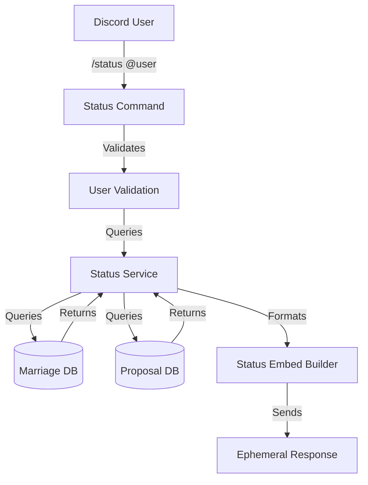

# System Design & Architecture

## Architecture Overview
**What is the high-level system structure?**



**Key components and their responsibilities:**
1. **Status Command**: Handles `/status` slash command, validates user parameter, calls status service
2. **Status Service**: Aggregates user data from multiple sources (marriages, proposals)
3. **Database Layer**: Prisma queries to fetch marriage and proposal data
4. **Embed Builder**: Formats status information into Discord embed format
5. **Response Handler**: Sends ephemeral response to user

**Technology stack choices and rationale:**
- **Discord.js v14**: Embed formatting, user fetching, ephemeral responses, user validation
- **Prisma**: Database queries for marriages and proposals (rate limits internal-only)
- **TypeScript**: Type safety for status data structures
- **Existing bot infrastructure**: Leverage command handler system
- **Discord API**: For user information (join date, account creation - secondary goals, if available)

## Data Models
**What data do we need to manage?**

**Status Data Structure:**
```typescript
interface UserStatus {
  userId: string;
  guildId: string;
  marriage: {
    isMarried: boolean;
    partnerId: string | null;
    partnerName: string | null;
    marriedAt: Date | null;
    channelId: string | null;
  } | null;
  proposals: {
    sent: {
      total: number;
      pending: number;
      accepted: number;
      declined: number;
    };
    received: {
      total: number;
      pending: number;
      accepted: number;
      declined: number;
    };
  };
  // Note: Rate limit information is internal-only, not displayed to users
}
```

**Database Queries Needed:**
1. **Marriage Query**: Get current marriage for user in guild
2. **Proposal Queries**: Count proposals by status (sent/received)
   - Total proposals sent (all statuses)
   - Total proposals received (all statuses)
   - Pending proposals sent
   - Pending proposals received
   - Accepted proposals count
   - Declined proposals count

**Data Flow:**
1. Command receives user parameter (or defaults to self)
2. Command validates user (exists, in server)
3. Status service queries database for:
   - Current marriage (if exists)
   - Proposal counts (sent/received by status: total, pending, accepted, declined)
4. Service aggregates data into UserStatus object
5. Embed builder formats UserStatus into Discord embed with all fields
6. Command sends ephemeral response
7. Error handling at each step with user-friendly messages

## API Design
**How do components communicate?**

**Status Service Interface:**
```typescript
class StatusService {
  /**
   * Get user status information
   * @param userId User ID to get status for
   * @param guildId Guild ID
   * @returns UserStatus object with all status information
   * @throws Error if database query fails or user not found
   */
  async getUserStatus(userId: string, guildId: string): Promise<UserStatus>;
  
  /**
   * Format status as Discord embed
   * @param status UserStatus object
   * @param user Discord User object (for display name/avatar)
   * @param guildName Guild name for footer
   * @returns EmbedBuilder ready to send
   * @throws Error if embed creation fails
   */
  formatStatusEmbed(
    status: UserStatus, 
    user: User, 
    guildName: string
  ): EmbedBuilder;
}
```

**Command Interface:**
```typescript
// Slash command structure
{
  data: SlashCommandBuilder
    .setName('status')
    .setDescription('Check user status and marriage information')
    .addUserOption(option => 
      option
        .setName('user')
        .setDescription('User to check status for (defaults to yourself)')
        .setRequired(false)
    ),
  execute: async (interaction: ChatInputCommandInteraction) => {
    // Implementation
  }
}
```

## Component Breakdown
**What are the major building blocks?**

**1. Status Command (`src/commands/status.ts`)**
- Handles slash command interaction
- Validates user parameter (defaults to self)
- Validates user is in server (for @user parameter)
- Calls status service
- Handles errors gracefully with user-friendly messages
- Sends ephemeral response
- Error handling:
  - User not found: "User not found or not in this server."
  - Invalid user: "Invalid user specified."
  - Database error: "An error occurred while fetching status information. Please try again later."

**2. Status Service (`src/services/statusService.ts`)**
- `getUserStatus()`: Aggregates data from database
  - Queries marriage data
  - Queries proposal statistics (sent/received by status)
  - Handles missing data gracefully
  - Throws errors for database failures
- `formatStatusEmbed()`: Creates Discord embed
  - Formats marriage information
  - Formats proposal statistics with all counts
  - Handles null/undefined values (shows "N/A")
  - Sets embed color, thumbnail, footer
- Helper methods for data formatting:
  - Date formatting (relative or absolute)
  - Number formatting
  - Null/undefined handling

**3. Database Queries (via Prisma)**
- Marriage queries: `prisma.marriage.findFirst()` with user/guild filter
- Proposal queries: `prisma.proposal.count()` with filters for:
  - Sent proposals (by proposerId)
  - Received proposals (by proposedId)
  - Status filters (pending, accepted, declined)
- Note: Rate limit queries not needed (internal-only, not displayed)

**4. Embed Formatting**
- **Title**: "{User}'s Status" or "Status: {User}"
- **Thumbnail**: User avatar (optional)
- **Fields**:
  - **Marriage Status**: "Married to @Partner" or "Not married"
  - **Married Date**: "Married on {date}" (formatted) or "N/A" if not married
  - **Proposals Sent**: "Total: X | Pending: Y | Accepted: Z | Declined: W"
  - **Proposals Received**: "Total: X | Pending: Y | Accepted: Z | Declined: W"
- **Footer**: Server name
- **Color**: Pink (0xff69b4) to match marriage theme
- **Timestamp**: Current time
- **Note**: Missing data shows "N/A" or "None" (graceful degradation)

## Design Decisions
**Why did we choose this approach?**

**1. Service Layer Pattern**
- **Decision**: Separate business logic (StatusService) from command handler
- **Rationale**: Reusable service, easier to test, follows existing pattern
- **Alternative**: Put logic directly in command (rejected - less maintainable)

**2. Ephemeral Responses**
- **Decision**: All status responses are ephemeral (private)
- **Rationale**: Privacy - users may not want their status public
- **Alternative**: Public responses (rejected - privacy concern)

**3. Real-time Database Queries**
- **Decision**: Query database each time (no caching)
- **Rationale**: Data accuracy, simple implementation, low query volume
- **Alternative**: Cache status (rejected - complexity not needed for MVP)

**4. Aggregated Statistics**
- **Decision**: Show proposal counts by status (sent/received)
- **Rationale**: Useful information without overwhelming detail
- **Alternative**: Show full proposal history (rejected - too much data)

**5. Optional User Parameter**
- **Decision**: User parameter is optional (defaults to self)
- **Rationale**: Most common use case is checking own status
- **Alternative**: Required parameter (rejected - less user-friendly)

## Non-Functional Requirements
**How should the system perform?**

**Performance:**
- Command response time: < 2 seconds
- Database queries: Optimized with existing indexes
- Embed rendering: < 100ms

**Scalability:**
- Handles concurrent status requests
- Database queries use indexes (no full table scans)
- No rate limiting needed (read-only operation)

**Security:**
- Input validation: User parameter must be valid Discord user
- No sensitive data exposure (only public marriage/proposal info)
- Ephemeral responses protect privacy

**Reliability:**
- Graceful error handling for missing data (shows "N/A" or "None")
- Clear error messages for invalid users (specific messages per scenario)
- Handles edge cases (no marriage, no proposals, database errors)
- Error messages match requirements specification
- Graceful degradation when data is missing

