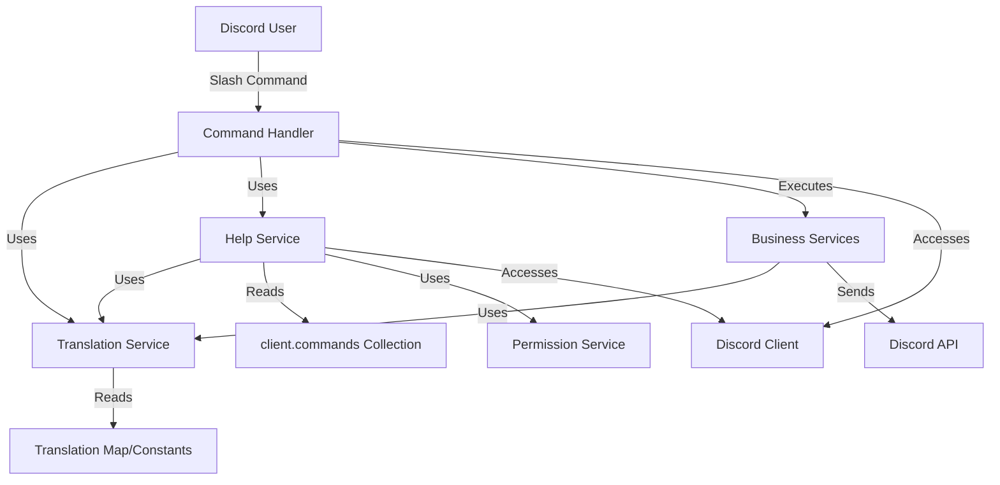

# System Design & Architecture

## Architecture Overview
**What is the high-level system structure?**



**Key Components:**
1. **Translation Service** (`src/services/translationService.ts`): Centralized service for all Vietnamese translations
2. **Help Service** (`src/services/helpService.ts`): Generates help command content
3. **Help Command** (`src/commands/help.ts`): New slash command implementation
4. **Translation Constants** (`src/utils/translations.ts`): Key-value map of all translations

**Technology Stack:**
- TypeScript (existing)
- Discord.js v14 (existing)
- No new dependencies required

## Data Models
**What data do we need to manage?**

### Translation System
- **No database changes required**
- Translations stored as TypeScript constants/objects
- Structure: `{ [key: string]: string }` for simple key-value mapping
- Optional: Support for parameterized translations (e.g., "Xin chào {user}!")

### Help Command Data
- **No database changes required**
- Command metadata read from existing command registry
- Help content generated dynamically from:
  - Command definitions (name, description)
  - Permission mappings (from `interactionCreate.ts`)
  - Translation service

### Data Flow
```
User → /help → HelpCommand → HelpService → TranslationService → Response
User → /kethon → KethonCommand → MarriageService → TranslationService → Response
```

## API Design
**How do components communicate?**

### Translation Service Interface
```typescript
class TranslationService {
  // Get translation by key with optional parameter substitution
  // Example: t('attendance.recorded', { count: 5 }) → "Đã ghi danh cho 5 người dùng"
  t(key: string, params?: Record<string, string | number>): string;
  
  // Optional convenience methods (can use t() with key prefixes instead):
  // getCommandDescription(commandName: string): string;  // Uses t(`command.${commandName}.description`)
  // getErrorMessage(errorKey: string, params?: Record<string, string>): string;  // Uses t(`error.${errorKey}`, params)
}
```

**Note**: The `t()` method is the primary interface. Convenience methods like `getCommandDescription()` are optional and can be implemented as wrappers around `t()` with key prefixes for better organization.

### Help Service Interface
```typescript
class HelpService {
  // Set Discord client (required to access command registry)
  setClient(client: Client): void;
  
  // Generate help embed for a user
  generateHelpEmbed(
    client: Client,
    userId: string,
    guild: Guild | null
  ): Promise<EmbedBuilder>;
  
  // Get command list by permission tier
  getCommandsByTier(
    commands: Collection<string, Command>,
    tier: PermissionTier
  ): Command[];
}
```

**Note**: HelpService needs access to:
- `client.commands` (Collection of all registered commands)
- `permissionService` (to check user permissions for filtering)
- `translationService` (for all text)

### Internal Interfaces
- Commands use `translationService.t('key')` instead of hardcoded strings
- Services pass translation keys or use translation service directly
- No changes to Discord API interactions

## Component Breakdown
**What are the major building blocks?**

### New Components

1. **Translation Service** (`src/services/translationService.ts`)
   - Singleton service
   - Provides `t(key, params?)` method for translations
   - Handles parameter substitution (e.g., `{count} users`)
   - Fallback to English if key missing (for development)

2. **Help Service** (`src/services/helpService.ts`)
   - Generates help command embeds
   - Organizes commands by permission tier
   - Uses translation service for all text
   - Requires Discord client to access command registry (`client.commands`)
   - Uses permissionService to determine which commands user can see

3. **Help Command** (`src/commands/help.ts`)
   - New slash command: `/help`
   - Permission: USER tier (all users can access)
   - Uses HelpService to generate response

4. **Translation Constants** (`src/utils/translations.ts`)
   - Centralized translation map
   - Organized by category (commands, errors, messages, embeds)
   - Type-safe with TypeScript

### Modified Components

1. **All Commands** (`src/commands/*.ts`)
   - Replace hardcoded English strings with `translationService.t()`
   - Update command descriptions to Vietnamese (`.setDescription()`)
   - Update command option descriptions to Vietnamese (`.addUserOption().setDescription()`)
   - Update embed titles/descriptions

2. **All Services** (`src/services/*.ts`)
   - Replace hardcoded messages with translations
   - Update error messages
   - Update embed content
   - **StatusService**: Update date formatting to Vietnamese style (e.g., "1 tháng 1, 2024")

3. **Event Handlers** (`src/events/interactionCreate.ts`)
   - Update error messages to Vietnamese
   - Update permission denial messages

4. **Button Labels** (`src/services/marriageService.ts`)
   - Update "Accept"/"Decline" button labels to Vietnamese

## Design Decisions
**Why did we choose this approach?**

### Decision 1: Centralized Translation Service
- **Rationale**: Single source of truth for all translations, easy to maintain
- **Alternative**: Hardcode Vietnamese strings in each file (rejected - harder to maintain)
- **Trade-off**: Slight overhead of function calls vs. maintainability (chose maintainability)

### Decision 2: Simple Key-Value Translation Map
- **Rationale**: No need for complex i18n library (only one language)
- **Alternative**: Use i18next or similar library (rejected - overkill for single language)
- **Trade-off**: Less flexible but simpler and no dependencies

### Decision 3: Keep Command Names in English
- **Rationale**: Discord command names are identifiers, changing breaks existing usage
- **Alternative**: Change command names to Vietnamese (rejected - breaking change)
- **Trade-off**: Commands stay `/kethon` but descriptions are Vietnamese

### Decision 4: Help Command as USER Tier
- **Rationale**: All users should be able to see available commands
- **Alternative**: ADMIN only (rejected - reduces usability)
- **Trade-off**: Help shows all commands but indicates permission requirements

### Decision 5: Parameterized Translations
- **Rationale**: Support dynamic content (user names, counts, dates)
- **Implementation**: Simple string replacement `{param}` → value
- **Example**: `"Đã ghi danh cho {count} người dùng"` → `"Đã ghi danh cho 5 người dùng"`

### Patterns Applied
- **Singleton Pattern**: TranslationService and HelpService as singletons (matches existing service pattern)
- **Service Layer Pattern**: Business logic separated from translation logic
- **Dependency Injection**: Services receive translation service as dependency (or import singleton)
- **Client Setter Pattern**: HelpService uses `setClient()` method (matches existing `marriageService.setClient()` pattern)

## Non-Functional Requirements
**How should the system perform?**

### Performance Targets
- Translation lookup: < 1ms (O(1) hash map lookup)
- Help command response: < 500ms (mostly Discord API latency)
- No impact on existing command execution time

### Scalability Considerations
- Translation map is in-memory (fast, but limited by memory)
- If translations grow large, consider lazy loading (not needed for MVP)
- Help command scales with number of commands (linear, acceptable)

### Security Requirements
- No new security concerns (translations are static data)
- Help command shows command names but not sensitive implementation details
- Permission information is already public (visible in Discord UI)

### Reliability/Availability Needs
- Translation service should never fail (fallback to English if key missing)
- Help command should always respond (even if some commands fail to load)
- Graceful degradation: Missing translations show key name instead of crashing
- HelpService should handle missing client gracefully (return error message in Vietnamese)

### Additional Considerations

#### Command Option Descriptions
- All command option descriptions (e.g., `.addUserOption().setDescription()`) must also be translated
- These appear in Discord's command autocomplete/help UI
- Translation keys: `command.{commandName}.option.{optionName}.description`

#### Date and Number Formatting
- **StatusService date formatting**: Currently uses English format ("January 1, 2024")
- Should be updated to Vietnamese format: "1 tháng 1, 2024" or "ngày 1 tháng 1 năm 2024"
- Consider creating a `formatDateVietnamese()` helper in TranslationService or StatusService
- Numbers: Vietnamese uses periods for thousands (1.000) vs commas (1,000) in English - verify if needed

#### Initialization
- HelpService may need `setClient()` method (similar to `marriageService.setClient()`)
- Or can receive client as parameter in `generateHelpEmbed()` method
- **Decision**: Pass client as parameter to avoid initialization complexity

